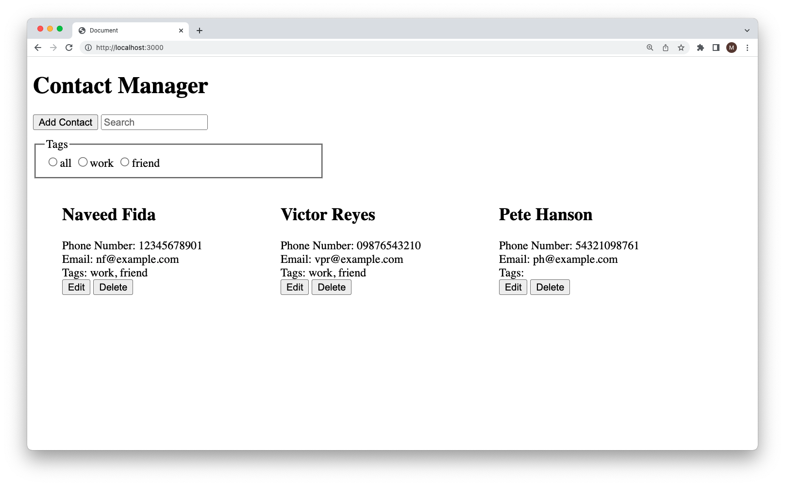
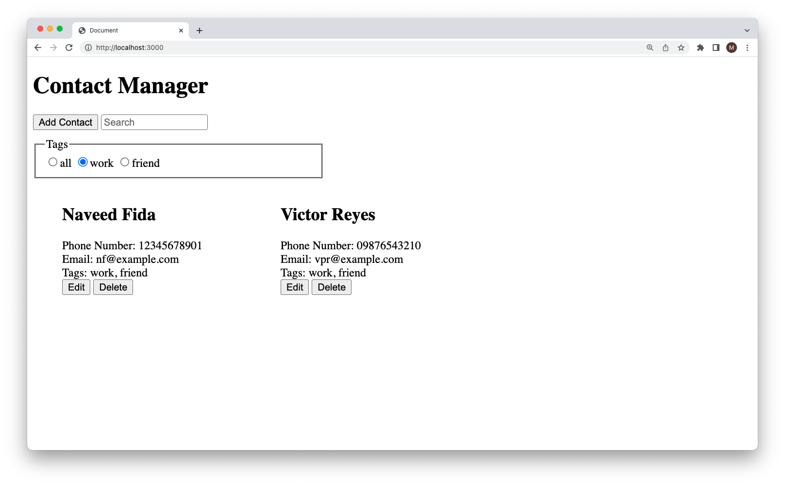

# Contact Manager

A contact management application built using `Node`, `JavaScript` and `Handlebars`.

## About

The application uses a simple API in order to add, edit and delete contacts.
Contacts can then be filtered by tag or equally searched for via the search bar.

## How to use

1. Clone the repo: `git clone https://github.com/Sinkinson/contact-manager.git`
2. `cd` into the directory
3. Run `npm install` to install dependencies
4. Run `npm start` to start application
5. Type `http://localhost:3000` into your browser

## All contacts

## Add contact

## filter contacts

## Improvements

- Case sensitivity on tags
- Allow contacts to be filtered by more than one tag
- Add CSS to improve UI
